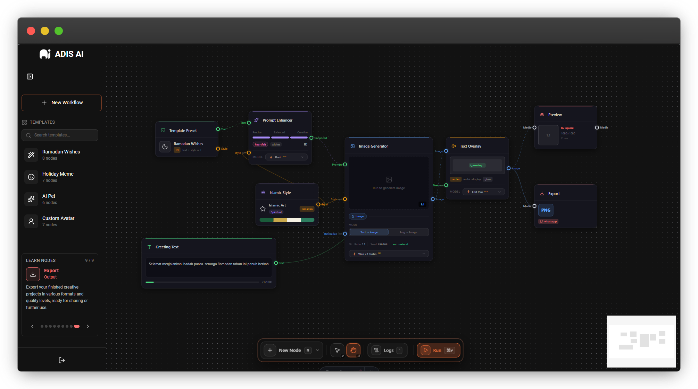

# ADIS AI - Web Application

A modular, node-based content generation engine designed to transform creative ideas into high-quality visual content including stickers, memes, and personalized greetings. Built with Astro, React, and React Flow for an intuitive visual workflow experience.



## Overview

ADIS AI provides a visual pipeline editor that enables users to create complex content generation workflows through an intuitive drag-and-drop interface. The application leverages Alibaba Cloud AI services (Qwen for text/reasoning, Wan for image/video generation) to power the content generation capabilities.

### Key Features

- **Visual Node-Based Editor**: Create and manage content generation pipelines using an intuitive canvas interface powered by React Flow
- **Typed Port System**: Connection validation ensures data compatibility between nodes with distinct port types (text, prompt, image, video, style, media)
- **Pipeline Execution Engine**: Client-orchestrated execution with server-side AI processing, featuring topology sorting and state management
- **Template Presets**: Quick-start workflows for common use cases including Ramadan Wishes, Holiday Memes, AI Pet, and Custom Avatar generation
- **Real-time Execution Feedback**: Live progress updates and logging during pipeline execution
- **Indonesian Cultural Context**: Specialized templates and content generation for Indonesian cultural events and celebrations

## Technology Stack

| Category | Technologies |
|----------|-------------|
| Framework | Astro 5.x with React 19 integration |
| UI Library | React 19, Tailwind CSS 4.x |
| Canvas Engine | @xyflow/react (React Flow) 12.x |
| Animations | GSAP 3.x |
| Icons | Lucide React |
| Deployment | Vercel (via @astrojs/vercel) |

## Node Categories

The pipeline editor supports five distinct node categories:

| Category | Description | Color Code |
|----------|-------------|------------|
| **Input** | Data entry points (Text Prompt, Image Upload, Template Preset) | Green |
| **Transform** | Data manipulation nodes (Prompt Enhancer, Style Config, Image to Text, Translate Text) | Purple |
| **Generate** | AI-powered content creation (Image Generator, Video Generator, Background Remover, Inpainting) | Blue |
| **Compose** | Layout and composition tools (Text Overlay, Frame Border, Sticker Layer, Collage Layout) | Orange |
| **Output** | Final output nodes (Preview, Export) | Red |

## Project Structure

```
apps/web/
├── public/                    # Static assets (logos, SVGs, screenshots)
├── src/
│   ├── components/
│   │   ├── canvas/           # React Flow canvas components
│   │   │   ├── config/       # Node categories, model options, port configuration
│   │   │   ├── drawer/       # Node detail panel components
│   │   │   ├── execution/    # Pipeline execution engine
│   │   │   ├── hooks/        # Custom React hooks
│   │   │   ├── nodes/        # Node component implementations
│   │   │   ├── services/     # API service layer
│   │   │   ├── templates/    # Pre-built workflow templates
│   │   │   └── types/        # TypeScript type definitions
│   │   ├── landing/          # Landing page components
│   │   ├── layout/           # Application layout components
│   │   ├── templates/        # Template gallery components
│   │   └── ui/               # Reusable UI components
│   ├── layouts/              # Astro layout templates
│   ├── lib/                  # Utility functions
│   ├── pages/                # Astro page routes
│   └── styles/               # Global CSS and animations
└── package.json
```

## Getting Started

### Prerequisites

- Node.js 18.x or higher
- pnpm 8.x or higher
- Backend server running (see `apps/server`)

### Installation

```bash
# Navigate to the web application directory
cd apps/web

# Install dependencies (from monorepo root)
pnpm install
```

### Development

```bash
# Start development server
pnpm dev
```

The application will be available at `http://localhost:4321`.

### Build

```bash
# Create production build
pnpm build

# Preview production build locally
pnpm preview
```

### Linting

```bash
# Run ESLint
pnpm lint

# Run ESLint with auto-fix
pnpm lint:fix
```

## Available Templates

| Template | Description | Use Case |
|----------|-------------|----------|
| **Ramadan Wishes** | Generate personalized Ramadan greeting cards | Eid al-Fitr and Ramadan celebrations |
| **Holiday Meme** | Create viral holiday-themed memes | Social media content for holidays |
| **AI Pet** | Generate stylized pet character images | Personal pet avatars and stickers |
| **Custom Avatar** | Create personalized character avatars | Profile pictures and digital identities |
| **Blank Canvas** | Start from scratch with an empty workflow | Custom pipeline creation |

## Architecture

### Execution Model

The application implements a client-orchestrated, server-executed architecture:

1. **Frontend Orchestrator**: Manages execution graph topology, state management, and execution ordering
2. **Server Executor**: Stateless AI processing endpoint that validates inputs and calls AI APIs
3. **Real-time Updates**: SSE-based progress updates during pipeline execution

### Port Type System

The port type system ensures data compatibility through a static compatibility matrix:

- `text`: Plain text data
- `prompt`: AI prompt data (enhanced text for generation)
- `image`: Image data with URL reference
- `video`: Video data with URL reference
- `style`: Style configuration (art style, color palette, mood)
- `media`: Generic media type (compatible with image and video)

## Configuration

### Environment Variables

The web application connects to the backend server. Ensure the following configuration:

```
API_BASE=http://localhost:3000
```

### Model Options

AI model configurations are defined in `src/components/canvas/config/modelOptions.ts` and can be customized based on available Alibaba Cloud Model Studio services.

## Contributing

1. Ensure all code follows the established ESLint configuration
2. Maintain TypeScript strict mode compliance
3. Follow the existing component structure and naming conventions
4. Add appropriate type definitions for new features
5. Test pipeline execution with various node configurations

## License

This project is proprietary software. All rights reserved.

## Acknowledgments

- **Alibaba Cloud** - AI infrastructure and model services
- **Qwen** - Text and reasoning capabilities
- React Flow team for the excellent node-based UI library
